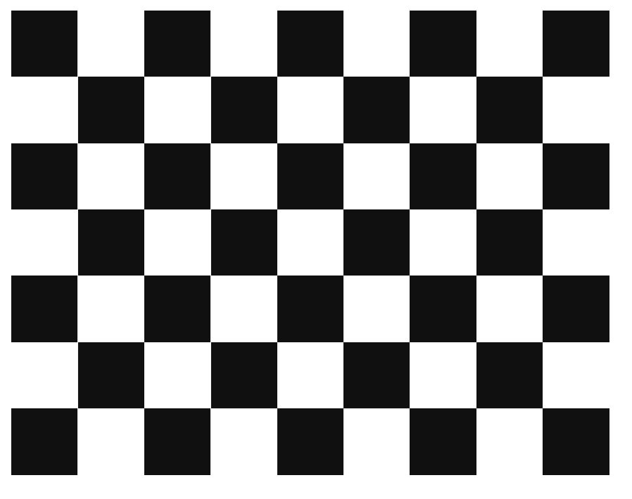
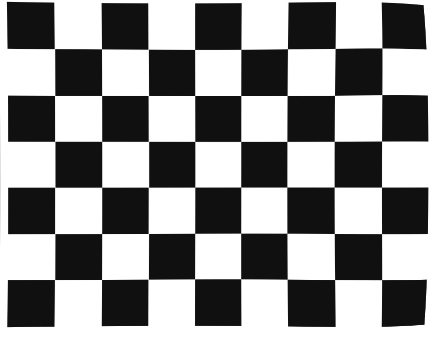

# ClearViewCam

## 프로젝트 개요

이 프로젝트는 OpenCV를 사용하여 카메라 캘리브레이션과 렌즈 왜곡 보정을 수행하는 예제입니다.  
체스보드 패턴 영상을 활용해 카메라의 내부 파라미터(초점 거리, 광학 중심 등)와 렌즈 왜곡 계수를 계산하고, 이를 기반으로 촬영된 영상 및 이미지의 왜곡을 보정합니다.

## 주요 기능

- **카메라 캘리브레이션:**  
  - 체스보드 영상을 이용하여 내부 파라미터와 왜곡 계수를 계산합니다.
  - 리프로젝션 에러(RMSE)를 통해 캘리브레이션 정확도를 확인합니다.
  - 캘리브레이션 결과는 `calibration_params.npz` 파일에 저장됩니다.

- **렌즈 왜곡 보정:**  
  - 저장된 캘리브레이션 파라미터를 이용해 이미지의 렌즈 왜곡을 보정합니다.
  - 보정 전과 후 이미지를 비교 및 저장할 수 있습니다.

## 파일 구성

- `hw3.py`  
  체스보드 영상을 기반으로 카메라 캘리브레이션을 수행하는 스크립트입니다.

- `hw3_2.py`  
  캘리브레이션 결과를 이용하여 입력 이미지의 렌즈 왜곡을 보정하는 스크립트입니다.

- `calibration_params.npz`  
  캘리브레이션 수행 후 생성되는 파라미터 파일 (카메라 행렬, 왜곡 계수 등).

- 기타  
  체스보드 영상 파일(`chessboard.mp4`) 및 테스트 이미지(`chessboard.jpg`) 등.

## 실행예시(스크린샷: 좌 원본, 우 왜곡사진)
<table>
  <tr>
    <td align="center" style="padding-right: 50px;">
      
    </td>
    <td align="center" style="padding-left: 50px;">
      
    </td>
  </tr>
</table>

